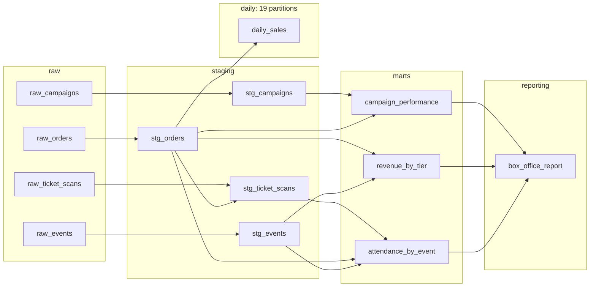

# Cadence Hall — a Dagster quickstart you can finish over lunch

You just became the data person at **Cadence Hall**, a fictional 1,200-cap live-music venue
seven nights into an eight-night summer stand (July 1–8, 2025). Three teams are already in your
inbox. Marketing wants to know *"which campaign actually sold tickets?"* The box office wants
*"revenue by tier, net of refunds."* Operations wants *"how many sold tickets actually walk
through the door?"* This repo is the venue's data platform in miniature: ~3,600 ticket orders,
12 marketing campaigns, and 8 nights of gate scans flowing through a 13-asset Dagster pipeline
into a local DuckDB file — and the lineage graph in the Dagster UI turns out to be the org
chart of the business.

> [!IMPORTANT]
> **One data-quality check is designed to fail — red — on your very first run.**
> That's Step 5. It's the whole point of this quickstart. **Don't file a bug.**

> [!NOTE]
> Written against **Dagster 1.13** (pinned to `1.13.20` in `uv.lock`). Everything runs
> **fully offline** and deterministically (seed 42) — the network is needed only for
> installing (Steps 0–1); from Step 2 on, nothing touches it.
> The data is **synthetic, seeded to be interesting — not industry benchmarks.** It's stamped
> as such so nobody quotes a fictional venue's ROAS in a real meeting.

## Table of contents

- [Welcome to Cadence Hall](#welcome-to-cadence-hall)
- [Step 0 — Install prerequisites (optional)](#step-0--install-prerequisites-optional)
- [Step 1 — Clone and bootstrap](#step-1--clone-and-bootstrap)
- [Step 2 — Launch Dagster](#step-2--launch-dagster)
- [Step 3 — Materialize everything](#step-3--materialize-everything)
- [Step 4 — Read the code (10 files, honestly)](#step-4--read-the-code-10-files-honestly)
- [Step 5 — The red check](#step-5--the-red-check)
- [Step 6 — Automate it](#step-6--automate-it)
- [Step 7 — Partitions (optional, ~3 min)](#step-7--partitions-optional-3-min)
- [Step 8 — Test it like software (optional, ~3 min)](#step-8--test-it-like-software-optional-3-min)
- [Make it yours](#make-it-yours)
- [Where to go next](#where-to-go-next)
- [Command reference & troubleshooting](#command-reference--troubleshooting)

## Welcome to Cadence Hall

Here is the entire pipeline — all 13 assets, before you install anything. GitHub renders this
diagram from the same structure Dagster will show you live in Step 2:



Left to right: CSVs land as **raw** assets, get typed and cleaned in **staging**, answer one
business question each in **marts**, and roll up into a single executive **reporting** asset.
The **daily** group is the optional partitions chapter (Step 7).

**What you'll learn**, mapped to steps:

- [ ] **Step 2** — software-defined assets and lineage: Dagster knows what *should* exist before anything runs
- [ ] **Step 3** — materialization, IO managers (DataFrame in, DuckDB table out), rich metadata in the UI
- [ ] **Step 4** — the one dependency rule (parameter name = upstream asset name) and selective recomputation
- [ ] **Step 5** — asset checks: a red check, lineage-guided debugging, a one-line fix that changes a business answer
- [ ] **Step 6** — jobs, a cron schedule, and a file-drop sensor that triggers a run by itself
- [ ] **Step 7** *(optional)* — daily partitions and a 19-partition backfill
- [ ] **Step 8** *(optional)* — testing the pipeline like software

Budget **about 30 minutes** for Steps 1–6. Steps 7 and 8 are optional and add ~3 minutes each.

**One convention before we start:** every command in this guide appears twice — the `make`
shortcut, then the raw command it runs. If you're on Windows without `make` (or you just like
seeing the machinery), run the raw command; a PowerShell variant is printed wherever it
differs. The full side-by-side table lives in
[Command reference & troubleshooting](#command-reference--troubleshooting).

## Step 0 — Install prerequisites (optional)

**Skip this step entirely if `uv --version` prints something.** [uv](https://docs.astral.sh/uv/)
is the only tool you need to install — it fetches Python itself. (You'll also want `git`,
which you almost certainly have.)

macOS / Linux:

```bash
curl -LsSf https://astral.sh/uv/install.sh | sh
```

Windows (PowerShell):

```powershell
powershell -ExecutionPolicy ByPass -c "irm https://astral.sh/uv/install.ps1 | iex"
```

Homebrew, if that's your thing:

```bash
brew install uv
```

> [!TIP]
> **Escape hatch:** if a corporate proxy blocks those installers, `pip install uv` works
> too — uv is just a Python package. More proxy notes in
> [docs/troubleshooting.md](docs/troubleshooting.md).

You do **not** need to install Python. The repo commits a `.python-version` file pinning
`3.11`, and uv auto-fetches that interpreter the first time you sync. Only this step and
Step 1's `uv sync` need the network — **from Step 2 on, the whole pipeline runs offline**.

Already set up? Jump to [Step 1](#step-1--clone-and-bootstrap).

## Step 1 — Clone and bootstrap

```bash
git clone https://github.com/lmansf/quickstart-guide-dagster.git
cd quickstart-guide-dagster
make setup
```

Raw equivalent of `make setup` (all platforms):

```bash
uv sync --frozen
```

That one command created `.venv/`, fetched Python 3.11 if you didn't have it, and installed
the **exact** dependency versions recorded in the committed `uv.lock` — `--frozen` means uv
reproduces the lockfile byte-for-byte rather than re-resolving. Pinning matters more in a
tutorial than almost anywhere else: you and this guide need to be looking at the same Dagster,
the same pandas, the same everything, or "your screen won't match the words" bugs creep in.

## Step 2 — Launch Dagster

```bash
make dev
```

Raw equivalent (macOS/Linux):

```bash
DAGSTER_HOME=$PWD/.dagster_home uv run dagster dev
```

Windows PowerShell:

```powershell
$env:DAGSTER_HOME = "$PWD\.dagster_home"; uv run dagster dev
```

Open **http://localhost:3000**. Leave this terminal running for the rest of the guide — it's
the Dagster webserver plus the daemon that powers schedules and sensors. (First launch pops a
"Join the Dagster community" dialog — **Skip** works fine.)

Take the thirty-second tour:

1. In the left nav, open **Assets**, then switch to the **lineage / graph view**.
2. You'll see the same picture as the diagram above: **five colored groups** — `raw`,
   `staging`, `marts`, `reporting`, `daily` — wired left to right.
3. Click any asset. Every one has a plain-English description, and every one says
   **"Never materialized."**

That last part is the mental flip coming from cron jobs and task schedulers: Dagster isn't a
to-do list of scripts, it's a **declaration of what data should exist**. It knows the full
graph — every table, every dependency — before a single row has been computed. Runs are just
the act of making reality match the declaration.

> [!NOTE]
> **Why the `DAGSTER_HOME` bit?** It points Dagster's instance state (run history, sensor
> cursors, schedule state) at the committed `.dagster_home/` directory, so your history
> survives restarts. The only real file committed there, `dagster.yaml`, does exactly one
> thing: turns telemetry off (a `.gitignore` beside it keeps the runtime state out of git).

## Step 3 — Materialize everything

Click **Materialize all** in the lineage view and Dagster opens a *"Launch runs to
materialize 13 assets"* dialog asking about partitions — that's `daily_sales` raising its
hand early (it gets its own chapter in Step 7). For your first run, take the simpler road:
**Cancel** that dialog, open the **Jobs** page, click **`refresh_all`**, and hit
**Launch run** — that job packages exactly the 12 un-partitioned assets. Then watch:
12 assets flow left to right in about 15 seconds, each turning green as its DuckDB table lands.

Now for the payoff. Click **`box_office_report`** → its latest materialization → the
**metadata** pane → **`executive_summary`**. That one Markdown block answers all three
questions from your inbox: which campaign won, revenue by tier net of refunds, and who
actually showed up — **Static Bloom drew the worst show-up rate (~72%)**. The report table
itself holds the other headline as a KPI row: `sellout_events: Neon Coyote` — all 1,200
caps gone. Total net revenue for the stand lands at **$335,166.00**. Notice something's
**red** in the checks column along the way? Good eye. Hold that thought until Step 5.

Prove the warehouse is real — it's one plain DuckDB file at `data/warehouse/cadence.duckdb`:

```bash
make query Q="SELECT * FROM campaign_performance ORDER BY attributed_revenue DESC"
```

Raw equivalent (all platforms — quote the SQL):

```bash
uv run python scripts/query.py "SELECT * FROM campaign_performance ORDER BY attributed_revenue DESC"
```

You'll get a Markdown table of all 12 campaigns plus two special rows: **`(organic)`** (orders
with no promo code at all) and **`(unattributed)`** (orders whose code matched *no* campaign —
remember that row; it's Step 5's smoking gun). Also note **Retarget Blitz (CMP-04)**: real
spend, zero attributed orders — it has no promo code, so code-based attribution is blind to
that channel. That's a lesson about attribution, not a bug.

> [!NOTE]
> **Why does `query.py` open read-only and close immediately?** The warehouse is a single
> DuckDB file, and DuckDB allows **one writer at a time**. A lingering open connection — a
> notebook, a REPL, a query left running — blocks Dagster's next materialization. The exact
> error and fix are in [docs/troubleshooting.md](docs/troubleshooting.md). Prefer the CLI
> (`make materialize` → `uv run dagster job execute -m cadence.definitions -j refresh_all`)
> if you ever want this step headless.

## Step 4 — Read the code (a dozen small files, honestly)

The whole pipeline is a dozen small Python files (two of them empty `__init__.py`s), and
you can read them in one coffee:

```
cadence/
├── definitions.py        # the project's table of contents — pure wiring, no logic
├── resources.py          # ONE resource: a DuckDB IO manager + path constants
├── data_gen.py           # the deterministic synthetic-data generator (seed 42)
├── assets/
│   ├── raw.py            # 4 assets: read the CSVs verbatim
│   ├── staging.py        # 4 assets: parse, clean… and one loud TODO
│   ├── marts.py          # 3 assets: one business question each
│   ├── report.py         # 1 asset: the executive report
│   └── daily.py          # 1 asset: the partitioned chapter (Step 7)
├── checks.py             # 4 data-quality checks (one is meant to be red)
└── automation.py         # 2 jobs, 1 schedule, 1 sensor (Step 6)
```

Read them in flow order — `raw.py` → `staging.py` → `marts.py` → `report.py` — then
`definitions.py` to see how little wiring it takes. Two things to notice:

**The one rule.** Look at any asset signature, e.g. in `marts.py`:

```python
def campaign_performance(stg_orders: pd.DataFrame, stg_campaigns: pd.DataFrame) -> pd.DataFrame:
```

A **parameter named after an upstream asset _is_ the dependency declaration**. No DAG file, no
`>>` operators, no YAML. The parameter name must match the upstream asset name exactly —
that's the entire dependency mechanism in this project.

**Where's the SQL?** There isn't any. Every asset returns a `pandas.DataFrame`, and the single
shared **IO manager** in `resources.py` (`DuckDBPandasIOManager`, resource key `io_manager`)
persists each one as a DuckDB table named after the asset, schema `main`. Storage is a
pluggable detail, not something each asset re-implements.

**Micro-exercise — the first aha.** In the UI, select **only** `campaign_performance` and
materialize it. Two things happen: only that asset runs (Dagster recomputed one table, not
twelve), and `box_office_report` downstream gets flagged as **stale/unsynced** — Dagster knows
its input changed underneath it. Selective recomputation plus staleness tracking is most of
the reason asset graphs beat script schedulers.

> [!NOTE]
> **Production notes (for later, not now):** when one schema stops being enough, asset
> `key_prefix`es can route different groups to different schemas; and when you'd rather write
> SQL than pandas, `DuckDBResource` gives assets a raw connection instead of DataFrame
> round-trips. This project deliberately uses neither — one concept per step.

## Step 5 — The red check

Your first run **succeeded**, and yet there's a red mark on `campaign_performance`. Click into
the check: **`all_promo_orders_attributed`** — *"EXPECTED TO FAIL on first run — see README
Step 5."* Welcome to the centerpiece.

Read the check's metadata like the analyst you now are:

- `unattributed_orders`: **150** — promo-coded orders that matched no campaign
- `unattributed_revenue`: **$13,703.00** — money marketing
  spent real dollars to earn, credited to nobody
- `sample_bad_codes`: strings like `' SUMMER25'`, `'summer25'`, and `'VIPNIGHT '`
- `hint`: *"Open `cadence/assets/staging.py` and find the TODO…"*

There's the crime scene: marketing typed promo codes by hand — leading spaces, trailing
spaces, lowercase, Title Case — and `campaign_performance` joins on the code **exactly as
typed**. 150 orders fall through the join into that `(unattributed)` row you saw in Step 3.

Note what the lineage just did for you: the **check lives on the mart** (that's where the
business question is answered, so that's where quality is asserted), but the graph shows the
mart is built from `stg_orders` — so the **fix belongs in staging**, where every downstream
consumer inherits it. Open `cadence/assets/staging.py`, find the loud TODO in `stg_orders`,
and add the one line it asks for:

```python
df["promo_code"] = normalize_promo_codes(df["promo_code"])
```

(`normalize_promo_codes` is defined at the top of the same file — it's just
`.str.strip().str.upper()`, NA-preserving. Writing that inline works too.)

Save the file. Before re-running, see the blast radius of your one-line fix: in the
lineage view's selection box, type `key:"stg_orders"+` — the trailing `+` is Dagster's
selection syntax for "this asset and its descendants" — and the graph filters to
`stg_orders` plus the six assets your fix touches. Now re-run the simple way: back to
the **Jobs** page, launch **`refresh_all`** again (same button as Step 3). Two things flip:

1. **The check goes green.** All 150 orders now find their campaign.
2. **The answer changes.** Re-run the Step 3 query: **Summer Kickoff jumps to #1 among
   campaigns** (the `(organic)` no-code row still tops the raw table) — it was
   the most undercounted campaign (~90 of the dirty codes were its `SUMMER25`) — and tiny
   **VIP Love Letter** ($120 spend, ~30 recovered `VIPNIGHT` orders) becomes the **best
   revenue-per-dollar** campaign on the board.

You didn't just silence an alert. You changed which campaign gets next season's budget. That's
the whole quickstart in one sentence: **orchestration, lineage, and data quality are one
subject.**

> [!NOTE]
> **Severity, in one breath:** this check is **ERROR** severity but *non-blocking* — the run
> completes and the report still builds, loudly annotated. `show_up_rate_in_bounds` is a
> **WARN** — advisory only. And `order_amounts_valid` on `stg_orders` is **blocking**: if it
> fails, downstream assets don't run at all.

> [!TIP]
> **Break it on purpose (optional, 2 min):** open `data/raw/orders.csv`, copy any order row
> and paste it as a duplicate line (same `order_id` twice), and materialize everything. The
> blocking `order_amounts_valid` check fails on the duplicate ID and **halts the downstream
> graph** — bad data stops at staging instead of poisoning the report. (Why not just set a
> `qty` to `-1`? Try it: nothing turns red, because `stg_orders` *drops* non-positive rows
> before the check ever sees them — defense in depth.) Undo with
> `git restore data/raw/orders.csv`.

## Step 6 — Automate it

So far you've been the one clicking. `cadence/automation.py` defines the automation in four
short declarations — two jobs, a schedule, and a sensor:

- **`refresh_all`** — a job selecting the `raw`, `staging`, `marts`, and `reporting` groups
  (everything except partitioned `daily`, so the everyday button stays simple).
- **`refresh_admissions`** — `raw_ticket_scans` plus everything downstream of it: the minimal
  slice that must recompute when new gate scans arrive.
- **`daily_refresh`** — a cron schedule (`0 6 * * *` UTC) running `refresh_all`. In the
  **Automation** tab, toggle it **on**, watch the UI show its next tick, then toggle it back
  off. It ships stopped on purpose — nothing in this repo runs behind your back.
- **`new_scan_file_sensor`** — the fun one.

The venue's gate hardware exports one CSV per show night into `data/scans/`. Nights 1–7 are
already there. Night 8 — Riverlight Orchestra — is being held back in `data/extra/`,
as if the night hasn't happened yet. The sensor polls the folder every **15 seconds** and,
using the last **filename** it has seen as its cursor, requests a run of `refresh_admissions`
for any new file.

Do the demo:

1. In **Automation**, toggle **`new_scan_file_sensor`** to **on**. Its first tick shows
   **Skipped** — *"first evaluation: recorded baseline of 7 existing files"*. That's
   deliberate: turning a sensor on should watch for what's *new*, not reprocess the
   archive it can already see.
2. Deliver night 8:

   ```bash
   make new-day
   ```

   Raw equivalent (macOS/Linux):

   ```bash
   cp data/extra/ticket_scans_2025-07-08.csv data/scans/
   ```

   Windows PowerShell:

   ```powershell
   Copy-Item data\extra\ticket_scans_2025-07-08.csv data\scans\
   ```

3. Watch the **Runs** page. **Within ~15 seconds** — the sensor's polling interval, so up to
   that long, not instantly — a `refresh_admissions` run appears, requested by the sensor
   with the new file's name as its run key (which is also what stops the same file from
   triggering twice).

When it finishes, open `attendance_by_event`: eight rows now instead of seven, and the
`overall_show_up_rate` metadata point moves — the UI plots numeric metadata across
materializations, so you can literally see the needle move. **Night 8's scans arrived; nobody
clicked anything.**

## Step 7 — Partitions (optional, ~3 min)

`daily_sales` (the `daily` group) is the same `stg_orders` data sliced by calendar day:
`daily_partitions = DailyPartitionsDefinition("2025-06-20", "2025-07-09")` — **19 partitions**,
2025-06-20 through 2025-07-08, exactly the sales window. Bounded on purpose: no partition
ahead of the data, no infinite backfill. (One honest wrinkle: the very last slice, July 8,
materializes **zero rows** — ticket sales close the night before each show, and July 8 is
show day for the final concert. An empty partition that *should* be empty still succeeds —
just materialize at least one non-empty day before running the query below, since an
empty-only write doesn't create the table.)

1. Click `daily_sales` in the lineage view — note the partition bar, 19 slots, all missing.
2. Materialize a single partition (say `2025-07-01`). One day's orders, grouped by tier.
3. Now open the **Materialize** dialog again and select **all 19 partitions** — Dagster
   launches a **backfill**. Watch the runs fan out and the partition bar fill in.

The trick that makes this warehouse-friendly: the asset carries
`metadata={"partition_expr": "order_date"}`, which tells the DuckDB IO manager to
**delete-and-insert only that date's slice** of the single `main.daily_sales` table. One
table, 19 independently rebuildable slices — re-running July 1 never touches July 4.

```bash
make query Q="SELECT order_date, SUM(net_revenue) AS net FROM daily_sales GROUP BY 1 ORDER BY 1"
```

Raw equivalent (all platforms — quote the SQL):

```bash
uv run python scripts/query.py "SELECT order_date, SUM(net_revenue) AS net FROM daily_sales GROUP BY 1 ORDER BY 1"
```

## Step 8 — Test it like software (optional, ~3 min)

The pipeline is a Python package, so it gets tested like one:

```bash
make test
```

Raw equivalent (all platforms):

```bash
uv run pytest
```

What's actually being tested is worth a skim in `tests/`:

- `test_definitions.py` — one line, `Definitions.validate_loadable(defs)`: catches every
  wiring error (bad dependency names, missing resources) before any run.
- `test_assets.py` — materializes the **real graph** into a throwaway DuckDB in a temp
  directory, then asserts business numbers: 8 KPI rows in the report, show-up rate in
  bounds, the `(unattributed)` and `(organic)` rows present, CMP-04 at zero.
- `test_checks.py` — **encodes the planted bug**: asserts `all_promo_orders_attributed`
  *fails* on shipped data with exactly 150 unattributed orders, and *passes* once codes are
  normalized. CI stays green while the bug ships — because the bug is a feature. (Already
  applied the Step 5 fix in your working tree? The shipped-bug test notices and **skips**
  with a note instead of failing — your suite stays green either way.)
- `test_generator.py` — regenerates the synthetic data at seed 42 and asserts it's
  **byte-identical** to the committed CSVs, plus referential-integrity and planted-dirt counts.
- `test_automation.py` — the file-drop sensor: baseline-and-skip on first evaluation, then
  exactly one run per genuinely new scan file.

And keep it tidy:

```bash
make lint
```

Raw equivalent: `uv run ruff check .`

## Make it yours

Three ways to keep going with this repo as your sandbox:

- **Steal the skeleton.** [docs/use-cases.md](docs/use-cases.md) — *"Six pipelines hiding
  inside this one"* — maps this exact structure onto marketing attribution, multi-venue
  ticketing, admissions funnels, memberships, webinars, and merch, each with a copy-this
  table. Then follow its five-step adaptation recipe.
- **Deal a new season.** `make data SEED=7` (= `uv run python scripts/generate_data.py --seed 7 --out data`)
  regenerates every CSV as a different-but-coherent season — same events and campaigns, new
  orders, new dirt. Re-materialize and watch every answer change. (Heads-up: `make test`'s
  byte-identity check compares seed 42 to the committed files, so restore with
  `make data SEED=42` — or `git checkout -- data` — when you're done.)
- **Start over.** `make reset` deletes the warehouse and puts `data/scans/` back to nights
  1–7. To fully replay the sensor demo you must also clear Dagster's memory of it (cursor
  *and* run history) — the recipe is in
  [docs/troubleshooting.md](docs/troubleshooting.md#what-make-reset-does-and-doesnt-do),
  and remember to re-materialize (Step 3) before the sensor fires again.

## Where to go next

Three links, not thirty:

1. **[Dagster docs](https://docs.dagster.io/)** — concepts you just used, in full depth:
   assets, checks, partitions, sensors.
2. **[Dagster University](https://courses.dagster.io/)** — free structured courses; Dagster
   Essentials is the natural next 4 hours.
3. **[dagster-dbt](https://docs.dagster.io/integrations/libraries/dbt)** — when your marts
   outgrow pandas, dbt models become Dagster assets in this same graph.

## Command reference & troubleshooting

Every `make` target and its raw equivalent. On Windows without `make`, run the raw column
(PowerShell variant where shown).

| `make` target | What it does | Raw equivalent (macOS/Linux; PowerShell where it differs) |
|---|---|---|
| `make setup` | Create `.venv`, install exact pins | `uv sync --frozen` |
| `make dev` | Launch Dagster at `localhost:3000` | `DAGSTER_HOME=$PWD/.dagster_home uv run dagster dev` · PS: `$env:DAGSTER_HOME = "$PWD\.dagster_home"; uv run dagster dev` |
| `make materialize` | Headless full refresh (no UI) | `uv run dagster job execute -m cadence.definitions -j refresh_all` |
| `make test` | Run the test suite | `uv run pytest` |
| `make lint` | Lint with ruff | `uv run ruff check .` |
| `make fmt` | Format with ruff | `uv run ruff format .` |
| `make query Q="…"` | Read-only SQL against the warehouse | `uv run python scripts/query.py "…"` |
| `make new-day` | Deliver night 8 to the sensor | `cp data/extra/ticket_scans_2025-07-08.csv data/scans/` · PS: `Copy-Item data\extra\ticket_scans_2025-07-08.csv data\scans\` |
| `make data` | Regenerate CSVs (`SEED=42` default) | `uv run python scripts/generate_data.py --seed 42 --out data` |
| `make reset` | Delete warehouse + temp dirs, restore nights 1–7 | `rm -f data/warehouse/*.duckdb data/warehouse/*.duckdb.wal data/scans/ticket_scans_2025-07-08.csv && rm -rf data/warehouse/*.duckdb.tmp .tmp_dagster_home_*` · PS: `Remove-Item data\warehouse\*.duckdb, data\warehouse\*.duckdb.wal, data\scans\ticket_scans_2025-07-08.csv -ErrorAction SilentlyContinue; Remove-Item -Recurse data\warehouse\*.duckdb.tmp, .tmp_dagster_home_* -ErrorAction SilentlyContinue` |

Top three issues (full versions and more in [docs/troubleshooting.md](docs/troubleshooting.md)):

| Symptom | Cause | Fix |
|---|---|---|
| `make dev` dies: port 3000 already in use | Another webserver (or an old `dagster dev`) holds the port | Run on another port: `DAGSTER_HOME=$PWD/.dagster_home uv run dagster dev -p 3001` — or stop the other process |
| `IO Error: Could not set lock on file "…cadence.duckdb"… Conflicting lock is held` | DuckDB is single-writer; a second connection (REPL, notebook, `make query` mid-run) holds the file | Close the other connection, then re-run. `scripts/query.py` avoids this by opening read-only and closing immediately |
| Windows: `'make' is not recognized` | No `make` on stock Windows | Use the raw-command column above — every target is one command. Full PowerShell table in [docs/troubleshooting.md](docs/troubleshooting.md) |

---

*Cadence Hall is fictional; the data is synthetic, generated by `cadence/data_gen.py` at seed
42 to make the story land. Schemas, dirt, and all derived columns are documented in
[docs/data-dictionary.md](docs/data-dictionary.md).*
