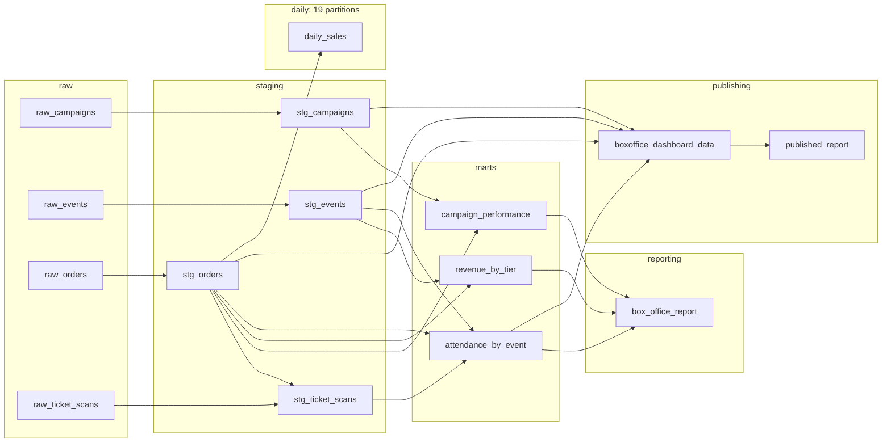

# The Dagster Quickstart Guide

Eight short chapters. Each one teaches a single Dagster concept by having you run it.

| # | Chapter | Time | You'll learn |
|---|---|---|---|
| 0 | [Set up and launch](00-setup.md) | 5 min | Install `uv`, bootstrap the project, get the Dagster UI running |
| 1 | [Assets and lineage](01-assets.md) | 8 min | Software-defined assets, the dependency rule, materialization, staleness |
| 2 | [IO managers and the warehouse](02-io-managers.md) | 6 min | How a returned DataFrame becomes a DuckDB table — and why storage is pluggable |
| 3 | [Checks and data quality](03-checks.md) | 10 min | Asset checks, severity, blocking; debug a real bug by following lineage |
| 4 | [Jobs, schedules, and sensors](04-automation.md) | 8 min | Selections, cron schedules, and a file-drop sensor that fires by itself |
| 5 | [Partitions and backfills](05-partitions.md) | 5 min | Slice by day, rebuild one slice without touching the others |
| 6 | [Publishing a report](06-publishing.md) | 5 min | Assets that produce artifacts people outside the team actually open |
| 7 | [Testing a pipeline](07-testing.md) | 5 min | Materialize into a throwaway warehouse and assert on real numbers |

**Chapters 1–4 are the core** — read them in order, they build on each other. Chapters 5–7 are
independent add-ons; take them in any order or skip them.

When you're done, [docs/use-cases.md](../use-cases.md) shows how to point the same skeleton at
marketing attribution, ticketing ops, admissions funnels, memberships, webinars, or merch.

## The example this guide drives

You've just become the data person at **Cadence Hall**, a fictional 1,200-cap live-music venue,
seven nights into an eight-night summer stand (July 1–8, 2025). Three teams are in your inbox:

- **Marketing** — *"which campaign actually sold tickets?"*
- **The box office** — *"revenue by tier, net of refunds?"*
- **Operations** — *"how many sold tickets actually walk through the door?"*

Answering those three questions is what builds the pipeline. Here it is — all 15 assets, before
you install anything:

Left to right: CSVs land as **raw** assets, get typed and cleaned in **staging**, answer one
business question each in **marts**, and roll up into an executive **reporting** asset. One
group per layer — a convention worth stealing.

## Conventions

**Every command appears twice**: the `make` shortcut, then the raw command it runs. Use the raw
form on Windows without `make`, or when you want to see the machinery. A PowerShell variant is
printed wherever it differs.

> [!IMPORTANT]
> **One check is designed to fail on your first run.** It's red on purpose and it's the whole
> point of [Chapter 3](03-checks.md). Don't file a bug.

**[Start with Chapter 0 →](00-setup.md)**
