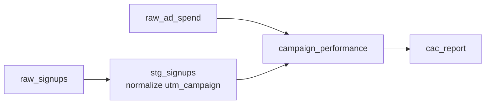
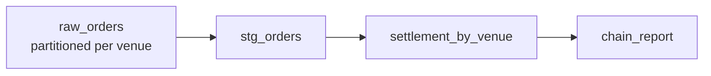
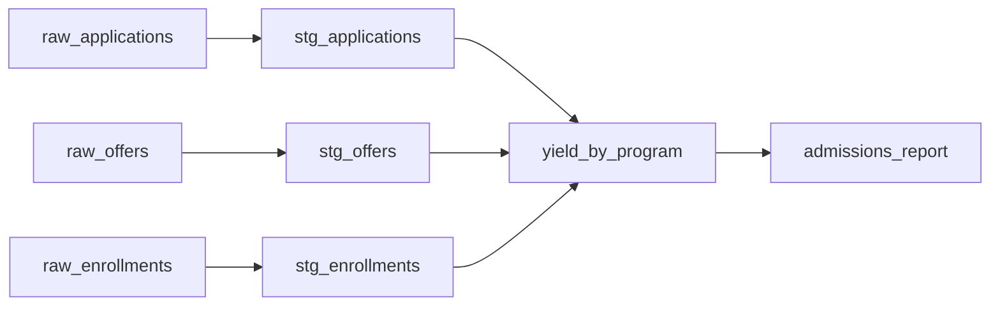
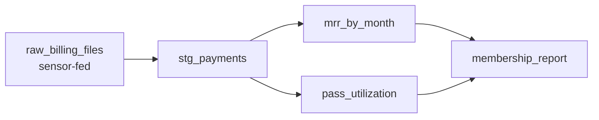
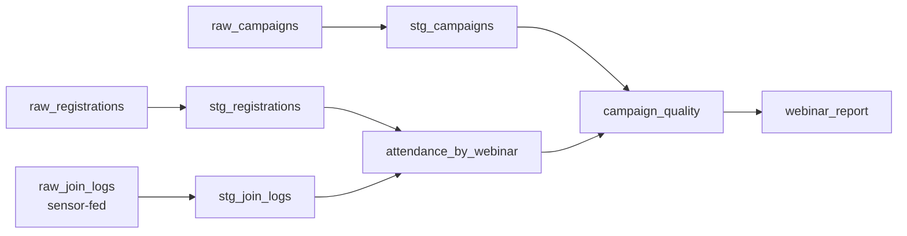
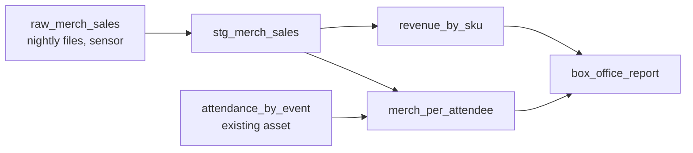

# Six pipelines hiding inside this one

Cadence Hall is a toy venue, but the shape you just built is not a toy. Strip the concert
posters off and the quickstart is: **sources with referential integrity → a staging layer
that normalizes the join keys → one mart per business question → a report asset on top** —
with **checks guarding the join keys** and **a sensor ingesting dropped files**. That shape
carries a remarkable share of real analytics work. Below are six pipelines that are this one
with the nouns changed: each has a short scenario, a sketch of the asset graph, and a
"copy this" table telling you exactly which quickstart file to open and what to change.

Names to keep handy while you read (the quickstart's cast): assets `raw_ticket_scans`,
`stg_orders`, `stg_ticket_scans`, `campaign_performance`, `revenue_by_tier`,
`attendance_by_event`, `box_office_report`, `daily_sales`; checks `all_promo_orders_attributed`,
`orders_reference_known_events`, `show_up_rate_in_bounds`, `order_amounts_valid`; automation
`new_scan_file_sensor`, `refresh_all`, `refresh_admissions`, `daily_refresh`.

## 1. Marketing attribution, generally

**Scenario.** SaaS signups, e-commerce orders, app installs — anywhere marketing buys traffic
and wants credit. UTM parameters and promo codes are typed by humans and mangled by URL
shorteners, so a slice of conversions silently fails to join to any campaign, and marketing
looks worse than it is. The bug you fixed in Step 5 — whitespace and casing breaking an exact
join — is the single most common attribution bug in the industry. The pipeline is the
quickstart's spine with signups in place of ticket orders.

**Copy this:**

| Quickstart file / asset | What changes |
|---|---|
| `cadence/assets/staging.py` — the `stg_orders` normalization TODO | Same one-liner (`.str.strip().str.upper()`), applied to `utm_campaign` instead of `promo_code` |
| `cadence/checks.py` — `all_promo_orders_attributed` | Rename to `all_signups_attributed`; same "every coded row joins a campaign" assertion, same metadata (count, lost value, sample bad codes) |
| `cadence/assets/marts.py` — `campaign_performance` | Swap `net_revenue` for signup value or trial-to-paid conversions; keep the `(unattributed)` and `(organic)` rows — they are the honesty of the report |

**Extension:** add a UTM fallback column and coalesce code-match → utm-match. That upgrades
the quickstart's CMP-04 lesson (a code-less campaign is invisible to code attribution) from a
caveat into a fix.

## 2. Box-office / ticketing ops for a multi-venue chain

**Scenario.** Five venues, each producing a nightly settlement export: orders, refunds,
per-tier revenue to reconcile against the promoter's numbers. The quickstart's refund
handling (`net_revenue` zeroed for refunded orders, gross kept for reconciliation) is exactly
the settlement logic, and each venue is an independent slice of the same tables. Swap the
quickstart's *daily* partitions for *static* per-venue partitions and the same graph runs per
venue.

**Copy this:**

| Quickstart file / asset | What changes |
|---|---|
| `cadence/assets/marts.py` — `revenue_by_tier` | Becomes `settlement_by_venue`; keep the gross/refunded/net columns and the appended `TOTAL` row |
| `cadence/assets/daily.py` — `daily_sales` | Swap `DailyPartitionsDefinition` for `StaticPartitionsDefinition` with your venue keys, e.g. `["north", "south", "downtown"]`; `partition_expr` points at a `venue_id` column instead of `order_date` |
| `cadence/automation.py` — job selections | `refresh_admissions`-style per-group jobs become per-venue jobs via partition selection |

## 3. University / program admissions funnel

**Scenario.** Applications come in, offers go out, some enrollees actually arrive — and the
dean wants "yield by program." That is structurally the quickstart's Ops question: tickets
*sold* versus tickets *scanned* is offers *made* versus students *enrolled*, and a yield rate
is a show-up rate wearing a gown. (Event-entry admissions is the quickstart itself; this is
the same skeleton on the application-style funnel.) Even the sanity bounds transfer: yield
can't exceed 1.0, and enrollments must reference real offers.

**Copy this:**

| Quickstart file / asset | What changes |
|---|---|
| `cadence/assets/marts.py` — `attendance_by_event` | Nearly verbatim: `tickets_sold`/`tickets_scanned`/`show_up_rate` become `offers_made`/`enrolled`/`yield_rate` |
| `cadence/checks.py` — `orders_reference_known_events` | Becomes `enrollments_reference_offers`; same "child keys exist in parent" assertion via `additional_ins` |
| `cadence/checks.py` — `show_up_rate_in_bounds` | Becomes `yield_rate_in_bounds`; same 0–1 bounds and "scanned ≤ sold" inequality |

## 4. Memberships & season passes

**Scenario.** A monthly billing file lands in a folder from the payment processor; finance
wants MRR by month, churn, and pass utilization — and a season pass that never gets scanned
is exactly the quickstart's no-show. The sensor-watches-a-folder pattern replaces night-8
scan files with billing drops, and the ticket fan-out idea (one order owns qty tickets)
becomes one pass owning its entitlements. Monthly partitions slice MRR the way `daily_sales`
slices order dates.

**Copy this:**

| Quickstart file / asset | What changes |
|---|---|
| `cadence/automation.py` — `new_scan_file_sensor` | Re-point the glob at your billing-drops folder; keep the filename cursor and `RunRequest(run_key=filename)` exactly |
| `cadence/assets/daily.py` — `daily_sales` | The `partition_expr` pattern with `MonthlyPartitionsDefinition`; one `mrr_by_month` table, independently rebuildable month slices |
| `cadence/assets/marts.py` — `attendance_by_event` | The sold-vs-scanned logic becomes passes-vs-entitlements-used for `pass_utilization` |
| `cadence/data_gen.py` — ticket fan-out | The order → `ORD-#####-T#` tickets expansion becomes pass → entitlements |

## 5. Webinar registrations → attendance

**Scenario.** Your webinar platform exports two CSVs per session: registrants and a join log.
Marketing wants to know which campaign drives people who *show up*, not just people who sign
up — attendance-weighted attribution. Join logs are messy in exactly the quickstart's ways:
people rejoin after dropping (the duplicate-scan problem) and test accounts appear in the
log with no registration (the orphan-scan problem). The dedupe-and-drop staging asset
transfers almost keystroke for keystroke.

**Copy this:**

| Quickstart file / asset | What changes |
|---|---|
| `cadence/assets/staging.py` — `stg_ticket_scans` | Verbatim: sort by timestamp, keep first row per person per session (rejoin dedupe = duplicate-scan dedupe), drop rows with no matching registration (orphan drop) |
| `cadence/automation.py` — `new_scan_file_sensor` | Watches the per-session export folder |
| `cadence/assets/marts.py` — `campaign_performance` | Join campaigns to *attendance* instead of orders — the mart now credits campaigns for humans in seats, not names on a list |

## 6. Merch sales at shows

**Scenario.** The merch stand's POS exports one CSV per show night. The questions are revenue
per SKU per event and whether merch tracks attendance — big crowd, big T-shirt night? This
one is special: instead of replacing the quickstart's graph, it **extends** it.
`merch_per_attendee` joins your new staging asset to the *existing* `attendance_by_event`,
and `box_office_report` simply gains an upstream. Adding an asset module plus one line in
`definitions.py` is the whole change — which is the point of asset-oriented orchestration.

**Copy this:**

| Quickstart file / asset | What changes |
|---|---|
| `cadence/assets/raw.py` — `raw_ticket_scans` | The read-a-directory-of-dated-files pattern (`sorted(glob)` + `pd.concat`) for POS exports |
| `cadence/assets/marts.py` — `revenue_by_tier` | Becomes `revenue_by_sku`: same group-sum-append-TOTAL shape, SKU in place of tier |
| `cadence/definitions.py` | Add your new module to `load_assets_from_modules([...])` — one line; the graph, lineage, and UI update themselves |

## The adaptation recipe

Every case above is the same five moves:

1. **Swap the sources.** Replace the CSVs in `data/raw/` (or re-knob `cadence/data_gen.py` to
   fake your domain while you prototype). Keep referential integrity between them — child
   keys must exist in parents.
2. **Rename the staging columns.** `cadence/assets/staging.py` is where types get parsed,
   join keys get normalized, and dirt gets dropped. Your Step 5 fix lives here, whatever your
   join key is called.
3. **Keep one mart per question.** Resist the mega-mart. Each asset in
   `cadence/assets/marts.py` answers exactly one team's question; that's why the lineage
   graph reads like an org chart.
4. **Re-point the checks at your join keys.** `cadence/checks.py`'s four checks are templates:
   values-in-range (`order_amounts_valid`), child-references-parent
   (`orders_reference_known_events`), every-coded-row-joins (`all_promo_orders_attributed`),
   and rate-in-bounds (`show_up_rate_in_bounds`). Nearly every pipeline needs those same four.
5. **Leave `automation.py` almost untouched.** A full-refresh job, a narrow
   downstream-of-the-fresh-file job, a stopped cron schedule, and a filename-cursor sensor
   cover a startling amount of real orchestration.

**The seams you reuse:** the raw assets are where any source plugs in (a directory of files,
an API dump, a database extract — downstream never knows); `definitions.py` is pure wiring,
so extending the graph is an import plus a list entry; and `partition_expr` fits any
time-grained (or venue-grained) mart that writes slices into one table.
